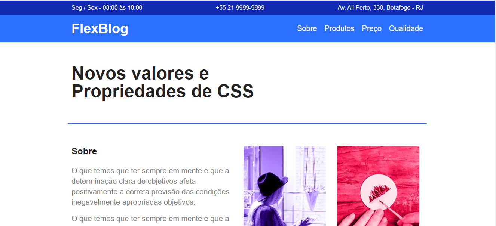
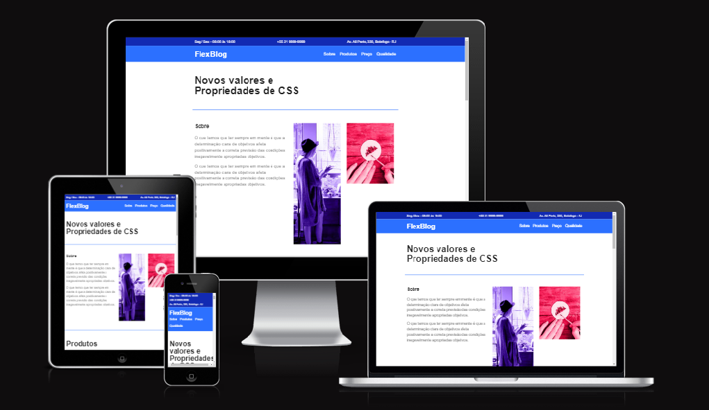

<hr>
<h1 align="center">📝Projeto FlexBlog</h1>
<p>Você poderá visualizar o projeto online clicando <a href="https://rodrigosouzasilva.github.io/projeto_Flexblog/">AQUI</a></p>


<div style="display: flex;align-items: center;">
<div style="flex:1"><p style="text-align:center"><font size="6">Projeto do curso de CSS Flexbox da Origamid, para a criação de uma página de um blog utilizando o display flexbox.</font></p></div> 
<div style="flex:1" align="right"><a href="https://www.origamid.com/"></a></div> 
</div>


<h1 align="center">💻📱Projeto responsivo</h1>



<h1 align="center">🚀Linguagens Utilizadas</h1>

<p align="center">


<h2 align="center">👨‍💻Curtiu o repositório? Fique à vontade para fazer uso dele!</h2>

```bash
# Clonar o repositório
$ git clone https://github.com/RodrigoSouzaSilva/projeto_Flexblog.git
# Ou
# Ir no code (botãozinho verde) e fazer download do zip.
```

<h2 align="center">😍 Muito obrigado pela visita! </h2>
<hr>

<a href="https://rodrigosouzasilva.github.io/web_site/"></a>